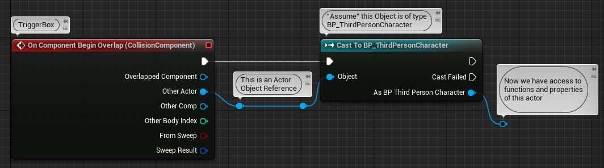

#### Intro

Jumping into Blueprints, one of the first question that often arises is how to make your different Blueprints 
**communicate with each other**, and that's what this article is about.

This topic can be tricky if you haven't had prior experience with object-oriented programming (OPP), so concepts 
covered here can be very abstract at first. You don't have to know everything at first, as you put more time into 
Blueperints things will eventually "click" in your mind.

!!! tip

    If you want a more in-depth video showcase on this topic, I highly recommend checking 
    out [**Zak Parrish's Live Training video**](https://www.youtube.com/watch?v=EM_HYqQdToE)
    on Blueprint Communication.  

---

## Communicating between Blueprints

Communication between Blueprints will always involve the following:  

- A **Sender** Blueprint
- At least one **Receiver** Blueprint

For Blueprints to communicate at the most basic level, one of them **has** to have a [**reference**](#getting-an-object-reference) to the other.

!!! note

    Blueprints does not have a way to just send a broad signal to *"everyone"*. Either the **Sender** has to know 
	about the **Receiver**, or vice versa. In other words, communication requires a **reference** at some point.

---

## Getting an object reference

Communication at the most basic level **always** requires a reference at some point, but knowing how to get a reference can be 
tricky. There are a variety of ways to get a reference depending on what you're trying to do.

!!! example annotate "Examples of common ways to get references"

    === "Tracing (Raycasting)"

        <figure markdown>
					{ width="700" }
					<figcaption>Example: Reference from a LineTrace (Raycast) hit result</figcaption>
				</figure>

    === "Collision Events"

        <figure markdown>
					{ width="700" }
					<figcaption>Example: Reference from Trigger Box Begin Overlap event</figcaption>
				</figure>
				
    === "Spawn a new actor"

        <figure markdown>
					{ width="700" }
					<figcaption>Example: Reference from spawning an Actor</figcaption>
				</figure>
				
    === "Getters of Framework Classes"

        <figure markdown>
					{ width="700" }
					<figcaption>Example: Getters of Framework Classes <br> These are accessable from most Blueprints</figcaption>
				</figure>
				
!!! Warning

    The ```GetActorOfClass``` and ```GetAllActorsOfClass``` nodes should almost never be used for anything other than 
    prototyping purposes. Nodes like this iterate through all of the actors in your level and can therefore 
    causes a huge performance hit. Use with caution!

---
## Communication Types
At the most basic level, there are 3 ways for Blueprints to communicate with each other:

- [Casting](#casting)

- [Event Dispatcher](#event-dispatcher)

- [Blueprint Interface](#blueprint-interface)

---
### Casting

Casting allows for direct communication from the **Sender** to the **Receiver**.

Once the **Sender** has a reference to the **Receiver**, casting is needed to specify to the compiler 
what type of object you're working with. By casting, you're telling the compiler to assume "Object X is of type Type Y". 
When this happens, you'll get full access to "Type Y's" functions and properties!

When to use Casting:

- When you need a quick and easy way for a **Sender** to communicate with one specific **Receiver**
- When the **Sender** knows exactly who the **Receiver** is going to be beforehand.

!!! example annotate "Casting Example"

    === "Step 1"

        <figure markdown>
					{ width="700" }
					<figcaption>Initiate the cast</figcaption>
				</figure>

    === "Step 2"

        <figure markdown>
					{ width="700" }
					<figcaption>We now have access to the functions and properties that we want to communicate with
					</figcaption>
				</figure>
				
    === "Step 3"

        <figure markdown>
					{ width="700" }
					<figcaption>We can now communicate with the other Blueprint!</figcaption>
				</figure>

??? Warning "Downsides to Casting"

    Casting is easy and convenient, but it has some downsides too. **If you're starting out you don't have to worry about it 
	much** but it's worth mentioning so you can start thinking about good Blueprint hygine:  
	
	- Casting creates a **dependency** on the Blueprint you're casting to, if you were to delete the Blueprint you've previously 
	casted to, you would have to clean up the casts too. This can become messy if you have a lot of casts in many different 
	places. [Blueprint Interfaces](#blueprint-interface) is an alternative if this becomes a concern.
	
	- Casting creates a **hard reference** to an object. This will cause the object to always **load** the object you're 
	casting to into memory. If you want to know more about hard references check out my 
	[**Hard and Soft References**](/ue5/hard-soft-references/) guide. A quick tip if this becomes a concern is to utilize
	[Blueprint Interfaces](#blueprint-interface) more.

	- If you cast every tick, or cast at the same time from many different blueprints (e.g on Begin Play), slowdowns and hiccups can 
	occur. This starts to become noticable after hundreds of simultanious casts however, so don't worry about it too much. 
	A tip is to cast once on BeginPlay and save the output to a variable that you can use several times.

---
### Event Dispatcher

Event Dispatchers allows for the **Receiver** to bind itself to the **Sender** and wait for it to do something. 

Unlike Casting and Blueprint Interfaces, Event Dispatchers does not require the **Sender** to have a reference to the **Receiver**. 
Instead the **Receiver** is the one with the reference and "subscribes" (binds) to the **Sender**. Once the **Sender** dispatches an 
event call, every **Receiver** that "subscribed" to this dispatcher will receieve a "signal" and trigger an event. This is especially
useful if you have a lot of **Receivers** that needs to react to the **Sender** doing something.

When to use Event Dispatcher:

- If you have one **Sender** that needs to communicate with many different **Receivers** at the same time.
- If the **Receiver** is the one with a reference to the **Sender** and not the other way around.

!!! example annotate "Event Dispatcher Example"

    === "Step 1"

        <figure markdown>
					
					<figcaption>Create the Event Dispatcher on the Sender</figcaption>
				</figure>

    === "Step 2"

        <figure markdown>
					{ width="700" }
					<figcaption>Now the sender can Call the Event Dispatcher when it wants to communicate with the Receivers
					</figcaption>
				</figure>
				
    === "Step 3"

        <figure markdown>
					{ width="700" }
					<figcaption>This is all that needs to be done from the Sender. On the next step we can see
					how the receiver binds to this Event Dispatcher</figcaption>
				</figure>
				
    === "Step 4"

        <figure markdown>
					{ width="700" }
					<figcaption>This is the receiver blueprint, we need to make it bind to the OnPawnDeath event.</figcaption>
				</figure>

    === "Step 5"

        <figure markdown>
					{ width="700" }
					<figcaption>Now the event GameOver is bound to the OnPawnDeath Event Dispatcher. GameOver will trigger
					when the sender calls OnPawnDeath</figcaption>
				</figure>
				
---
### Blueprint Interface

Blueprint Interfaces allows the **Sender** to communicate with a **Receiver** in a generic way, even when the **Sender** 
doesn't know what kind of **Receiver** it is.

For instance, you can make an "Interact" interface, and use it to communicate with any object you happen to click on.
Interfaces doesn't even care what you're interfacing with, or if the **Receiver** even has an implementation of your 
interface to begin with. You can simply send an interface message to anything you want, and if the **Receiver** cares; it 
will do something, if the **Receiver** doesn't care; nothing will happen.

For Blueprint Interfaces to work, you have to create a Blueprint Interface asset in the Content Browser. You also have
to implement the interface on the **Receivers**.

When to use Blueprint Interface:

- If you have a **Sender** that wants to communicate with a **Receiver**, but you don't care who the **Receiver** even is.
- If you want one generic way to communicate with different kinds of Blueprints.
- If you want to avoid dependencies and hard-referencing Blueprints.

!!! example annotate "Blueprint Interface Example"

    === "Step 1"

        <figure markdown>
					
					<figcaption>Create the Blueprint Interface asset in the Content Browser.</figcaption>
				</figure>

    === "Step 2"

        <figure markdown>
					{ width="700" }
					<figcaption>Open the Blueprint Interface asset and create a function that will serve as our Interface Message.
					</figcaption>
				</figure>
				
    === "Step 3"

        <figure markdown>
					{ width="700" }
					<figcaption>Now, any Sender can send this Interface Message to any Receiver.</figcaption>
				</figure>
				
    === "Step 4"

        <figure markdown>
					{ width="700" }
					<figcaption>In this example, we create a line trace and we send an interface message to any actor that happens to get hit by the trace.</figcaption>
				</figure>

    === "Step 5"

        <figure markdown>
					{ width="700" }
					<figcaption>For the Receiver to react to the Interface Message, it has to implement the Interface. 
					You do this in the Receiver's Class Settings.</figcaption>
				</figure>
				
    === "Step 6"

        <figure markdown>
					{ width="700" }
					<figcaption>Now the Receiver has the options to implement the function that we defined in the Blueprint Interface Asset.</figcaption>
				</figure>
				
    === "Step 7"

        <figure markdown>
					{ width="700" }
					<figcaption>Now the Receiver is ready to receive any "Interact" messages thrown at it, and it will react accordingly.</figcaption>
				</figure>
				