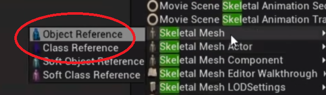
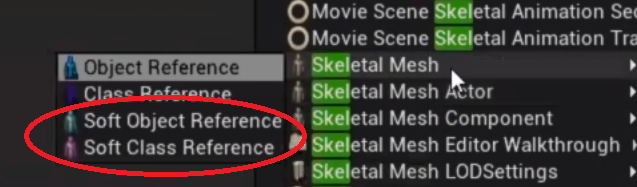

#### Intro
As a project becomes big, you might notice that that editor and loading times becomes big. This is usually a sign of poor dependency and memory management, and a heavy use of Hard References.

!!! tip

    If you want a more in-depth video showcase on this topic, I highly recommend checking out [**Demystifying Soft Object References | Inside Unreal**](https://youtu.be/K0ENnLV19Cw?si=eVfUeKu8ZeRlZD40).

---

## Hard References

Hard references creates a dependency on the asset you're referencing to. When an assets gets loaded in Unreal, it first synchronously loads all the dependencies of that asset. This can create a long chain of assets that has to be synchronously loaded. It's important to keep track of these references as they tend to go out of hand. I've seen crazy stuff in my career, like a main menu having a dependency on the final boss, through a long chain of references. 

Some ways hard references gets created that might not be obvious:
* Anytime your asset has a variable containing a **hard object reference** to another asset
* Anytime your asset **casts** to another asset
* Anytime your asset has events/functions with **inputs/output pins** of another asset
* If a **component's defaults** get set to specific assets (like a mesh, or a material)

## Soft References

Soft references creates a "soft" dependency. It references assets without being forced to load the asset in memory, instead you manually load the asset before you use it. Not only do you decide when to load the asset in question, you can also load it **asynchronously**. It's recommended to make heavy use of soft references on assets that take a lot of space in memory. Things like meshes, textures, materials, particles, sounds, or any objects/classes/data containers with hard references to big assets.

!!! tip

    It's important to occasionally use the [**Reference Viewer**](https://docs.unrealengine.com/5.2/en-US/finding-asset-references-in-unreal-engine/) to get a quick overview of asset references and make sure things are as they should. Size Map is another tool that can be useful to find assets with outlier memory-hogging references.

---
