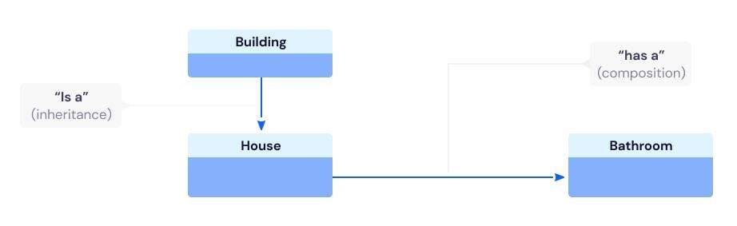

#### Intro

Inheritance and composition are both important design patterns in OOP. Even though compositional patterns are commonly preferred in the modern game-programming paradigm, both are heavily used in Unreal Engine. In this article we're gonna go though the pros and cons of both.

---

## Inheritance
Inheritance can be useful when there is shared functionality between classes that share an "is-a" relationship, especially if the shared functionality has to be tightly coupled and isn't used outside of said inheritance hierarchy.

!!! tip "Pros"

    * Performant if used correctly
    * Convenient
    * Intuitive linear structures of systems

!!! danger "Cons"

    * Inflexible
    * Hard to modify and extend
    * Deep nesting is hard to maintain

---

## Composition
Composition based programming is widely used in video game development because of its modularity and flexibility. This is mostly done through heavy use of components. This is especially useful if you want to compartmentalize features that you want to reuse in a variety of classes and contexts, and if classes and systems are going to be changed a lot during development.

!!! tip "Pros"

    * Flexible
    * Scalable
    * Encourages modularity
    * Encourages encapsulation
    * Easy to test different features in isolation

!!! danger "Cons"

    * Hard to understand when many components interact
    * Can become hard to debug if many components interact

---

## Inheritance vs composition
In general, composition should be favored over inheritance. The requirements in game development tend to change a lot, and composition is a flexible and modular pattern that can save a lot of time during rapid changes. 

Composition promotes encapsulation of different features which creates a lot of advantages. It makes your features modular, flexible, clear, easy to test and debug. Composition allows for designer to experiment and compose new classes that leverage already existing code, in contexts that was previously not planned for.

Composition can become complicated and hard to manage if a lot of components rely on each other however, and should still be carefully planned to ensure loose coupling and high cohesion. 

Inheritance can be powerful on certain scenarios, but should only really be used if you're sure the code wont change much. Any change on the superclass will cause a ripple effect on all the subclasses, which may result in unexpected problems due to the tight coupling super and subclasses tend to have. If not planned correctly, you tend to see a lot of implementations and properties in the subclasses that never gets used, creating a lot of confusion and uncertainty when trying to understand how the class works.