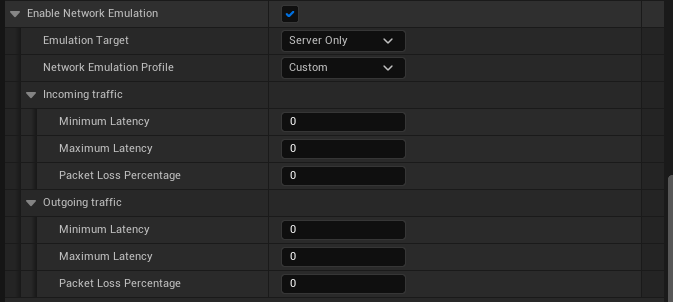

### Packet Simulation Settings

| Setting | Description |
| ---------------- | - |
| `PktLag` | Sets network packet lag (specified in ms) |
| `PktLagVariance` | Sets a variable network packet lag (+/- the amount specified in ms) |
| `PktLoss` | Simulates outgoing packet loss (specified in percent) |
| `PktIncomingLoss` | Simulates incoming packet loss (specified in percent) |
| `PktDub` | Simulates sending/receiving duplicate packets (specified in percent) |
| `PktOrder` | Simulates network packets received out of order (1 = enabled, 0 = disabled) |

More settings can be found in the 
[FPacketSimulationSettings docs](https://docs.unrealengine.com/4.27/en-US/API/Runtime/Engine/Engine/FPacketSimulationSettings/)

---

#### How to apply Packet Simulation settings
These settings can be set in `DefaultEngine.ini` 

``` ini linenums="1" title="DefaultEngine.ini"
[PacketSimulationSettings]
PktLag=250
PktLagVariance=20
PktLoss=10
PktDup=0
PktOrder=1
```

These settings can be set through the console


``` python title="Console"
NetEmulation.PktLag 300
```

Some of these settings can be set directly in the **Project Settings**

